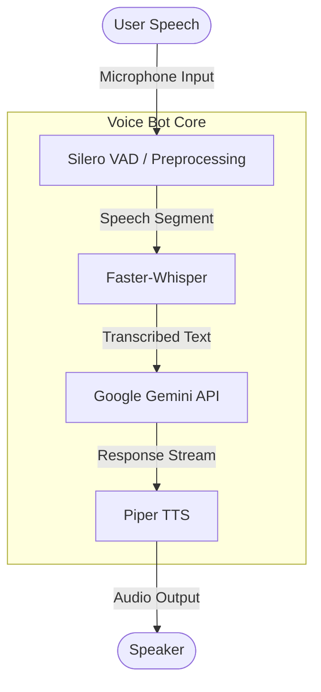

# Real-Time AI Voice Agent

**Team Name:** HindKeSItarey

## Project Overview
A low-latency, real-time voice AI agent. This project integrates state-of-the-art speech recognition, a powerful Large Language Model (LLM), and fast text-to-speech synthesis to create a conversational agent that feels natural and responsive.

## Architecture



## Tech Stack
*   **Faster-Whisper**: High-performance speech-to-text models (CTranslate2 backend).
*   **Google Gemini (via LangChain)**: Advanced LLM for understanding context and generating responses.
*   **Piper TTS**: Fast, local neural text-to-speech running on ONNX Runtime.
*   **Silero VAD**: Enterprise-grade Voice Activity Detection for precise turn-taking.
*   **PyAudio & NumPy/SciPy**: Real-time audio I/O and signal processing (spectral filtering).

## Setup Instructions

### 1. Prerequisites
Ensure you have Python 3.10+ installed.
You will also need system-level audio libraries (PortAudio).

**Linux (Debian/Ubuntu):**
```bash
sudo apt-get update
sudo apt-get install portaudio19-dev
```

### 2. Install Dependencies
Install the required Python packages:
```bash
pip install -r requirements.txt
```

### 3. Configuration
1.  Create a `.env` file in the project root.
2.  Add your Google Gemini API key:
    ```ini
    GOOGLE_API_KEY=your_google_api_key_here
    ```

### 4. Download Models
Run the setup script to download the necessary TTS voice models (Piper) and configuration files:
```bash
python download_models.py
```

### 5. Run the Code
Start the voice agent:
```bash
python main.py
```
