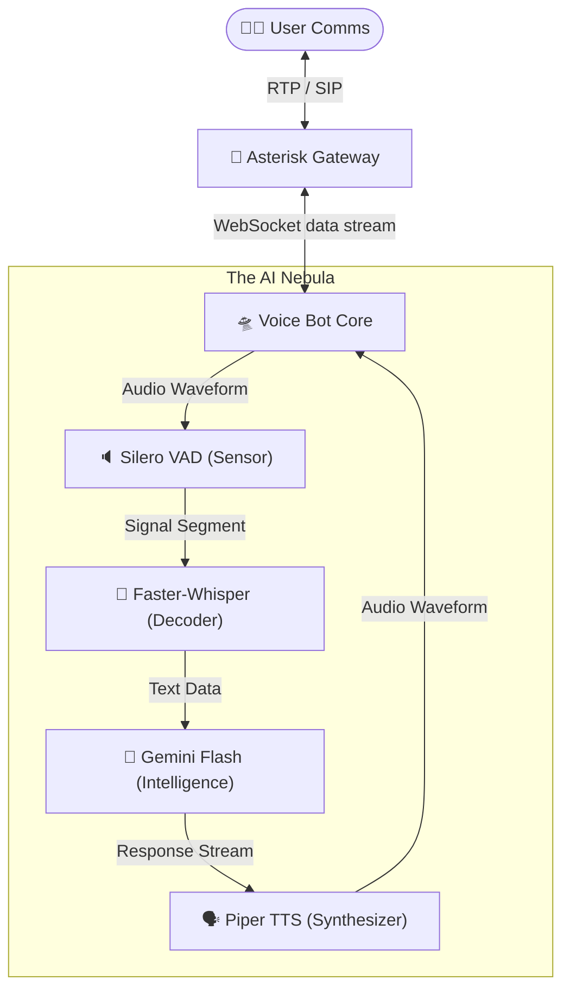

# 🌌Real-Time AI Voice Agent: Project DEVBITS 
> Team : [Shreshth Vishwakarma👦](https://github.com/Shre-shth) and [Shreshtha Shandilya👦](https://github.com/ShreshthaMax) 

This project implements a sophisticated Voice Bot for an enterprise named 'SHRESHTH ENTERPRISES' that integrates with Asterisk via the Asterisk REST Interface (ARI). It uses `faster-whisper` for Speech-to-Text (STT), `Piper` for Text-to-Speech (TTS), and Google's Gemini API for intelligent conversation and generating Minutes of Meeting (MOM).

## Demo Video
<>
It does not capture soft sneezes and coughs, just captures true speech.    
Automatic MOM generation after the call ends **([which is not shown in the video](https://github.com/Shre-shth/devbits26-PS1/blob/main/sample_MOM.md)).**

## Features

- **Real-time Transcription**: Uses `faster-whisper` for low-latency, high-accuracy STT.
- **Natural-sounding Speech**: Utilizes `Piper` TTS with various voice models for high-quality audio output.
- **Intelligent Conversations**: Powered by Google Generative AI (Gemini).
- **Voice Activity Detection (VAD)**: Efficiently detects speech using the Silero VAD model. Removes coughs and sneezes and does not detect them as speech.
- **Barge-in Support**: Allows users to interrupt the bot while it's speaking.
- **Outbound Calling**: Capability to initiate calls directly from the bot.
- **Automatic MOM Generation**: Summarizes conversations into professional Minutes of Meeting after the call ends.

## Prerequisites

- **Python**: 3.12 or higher.
- **Asterisk**: Installed and configured with ARI enabled (look for the files in [asterisk conf](https://github.com/Shre-shth/devbits26-PS1/tree/main/asterisk%20conf)).
- **NVIDIA GPU (Optional but Recommended)**: For accelerated STT and TTS performance.
- **NVIDIA Libraries**: Ensure `cublas` and `cudnn` are accessible if using GPU.

## Setup Instructions

### 1. Clone the Repository

```bash
git clone https://github.com/Shre-shth/devbits26-PS1.git
cd devbits26-PS1
```

### 2. Create and Activate Virtual Environment

```bash
python -m venv .venv
source .venv/bin/activate
```

### 3. Install Dependencies

```bash
pip install -r requirements.txt
```

### 4.  Download Models
Acquire the neural network weights required for onboard processing.

```bash
# VAD Sensor
wget -O silero_vad.onnx https://github.com/snakers4/silero-vad/raw/master/files/silero_vad.onnx

# Voice Synthesis Module (Amy Low, we used Amy you can try others from [this repo](https://github.com/rhasspy/piper/blob/master/VOICES.md))
wget -O en_US-amy-low.onnx "https://huggingface.co/rhasspy/piper-voices/resolve/v1.0.0/en/en_US/amy/low/en_US-amy-low.onnx?download=true"
wget -O en_US-amy-low.onnx.json "https://huggingface.co/rhasspy/piper-voices/resolve/v1.0.0/en/en_US/amy/low/en_US-amy-low.onnx.json?download=true"
```

### 5. Asterisk setup
**CRITICAL:** The Asterisk Gateway must be operational.

1.  **Deploy Asterisk**: Install following [official guides](https://wiki.asterisk.org/wiki/display/AST/Installing+Asterisk+From+Source).
2.  **Configure ARI (`/etc/asterisk/ari.conf`)**:
    ```ini
    [general]
    enabled = yes
    pretty = yes
    allowed_origins = *

    [brain]
    type = user
    read_only = no
    password = 1234
    password_format = plain
    ```
3.  **Establish Path (`/etc/asterisk/extensions.conf`)**:
    ```ini
    [default]
    exten => 1000,1,NoOp(Route to AI Core)
     same => n,Stasis(ai-bot)
     same => n,Hangup()
    ```
4. Similarly follow [asterisk conf] for all other conf files.
5. **Reboot Systems**: `sudo systemctl restart asterisk`


### 6  Configurations

Create a `.env` file in the root directory (use the provided example if available) and add your Google API key:

```env
GOOGLE_API_KEY=your_google_api_key_here
# Optional: Path to specific Piper voice model
VOICE_MODEL=en_US-amy-low.onnx
```

### 7  Run the application

Ensure that asterisks is properly setup and Zoiper(telephony) is connected. 
```bash
DIAL: 555 on Zoiper (or choose your own number)
```

Run directly with Python:

```bash
cd src
python main.py
```

## Project Structure

- `src/`: Core logic of the application.
    - `main.py`: Entry point of the bot.
    - `voice_bot.py`: Main bot logic and state management.
    - `ari_controller.py`: Handles communication with Asterisk ARI.
    - `transcriber.py`: STT implementation using `faster-whisper`.
    - `synthesizer.py`: TTS implementation using `Piper`.
    - `brain.py`: LLM integration and MOM generation logic.
    - `vad.py`: Voice Activity Detection logic.
    - `config.py`: Centralized configuration management.
    - `utils.py`: General utility functions.
- `en_US-*.onnx`: Pre-downloaded Piper voice models.
- `silero_vad.onnx`: Silero VAD model.
- `requirements.txt`: Python dependencies.
- `run.sh`: Shell script for running the bot.

## Usage

Once the bot is running, it will listen for incoming calls on the configured ARI endpoint. 

- To initiate an **outbound call** manually, type `call` in the terminal after running `main.py`.
- The bot will generate a `minutes_of_meeting.txt` file in the `src/` directory after each call session ends.

## 🛰️Architecture

Our architecture is designed for speed and stability, ensuring minimal signal decay (latency) across the pipeline.


For more details and high level architecture, check [documentation](https://github.com/Shre-shth/devbits26-PS1/blob/main/documentation.pdf).

## Troubleshooting

- **Library Not Found Errors**: If you encounter issues with `libcublas` or `libcudnn`, ensure your `LD_LIBRARY_PATH` is correctly set (the `run.sh` script attempts to do this automatically).
- **API Key Issues**: Verify that your `GOOGLE_API_KEY` is valid and has sufficient quota for Gemini API.


>**Crafted with love by Team HindKeSitare**
